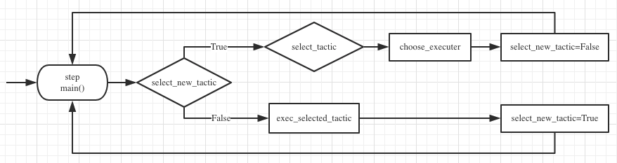

# StarCraft II Minigames

* Rule based game AI for 5 StarCraft II Minigames
    * max score achieved for these agents:
        * CollectMineralShards: 125
        * CollectMineralsAndGas: 5010
        * DefeatRoaches: 91
        * DefeatZerglingsAndBanelings: 220
        * BuildMarines: 132
* Author
    * [林子恒](https://lzhbrian.me) 1801213773
    * lzhbrian@gmail.com


## Usage

* Requirements: numpy, pysc2

* Files

    ```shell
    final_agent_lzh.py
    tactics.py
    ```

* Install

    * Install StarcraftII from battle.net (or [link](https://github.com/Blizzard/s2client-proto#downloads) for linux)
    * download minigame map in [link](https://github.com/deepmind/pysc2/releases/download/v1.2/mini_games.zip), extract and put in to your `StarcraftII/Maps/` directory
    * install pysc2 as [instructed](https://github.com/deepmind/pysc2) (`pip install pysc2`)
    * put [final_agent_lzh.py](final_agent_lzh.py) and [tactics.py](tactics.py) in your installed site-packages `pysc2/agents` path
        * for example `~\Anaconda3\Lib\site-packages\pysc2\agents\` (if you are using Anaconda)

* Usage

    ```shell
    # CollectMineralShards
    python -m pysc2.bin.agent --map CollectMineralShards --agent pysc2.agents.final_agent_lzh.CollectMineralShards --use_feature_units
    
    # CollectMineralsAndGas
    python -m pysc2.bin.agent --map CollectMineralsAndGas --agent pysc2.agents.final_agent_lzh.CollectMineralsAndGas --use_feature_units
    
    # DefeatRoaches
    python -m pysc2.bin.agent --map DefeatRoaches --agent pysc2.agents.final_agent_lzh.DefeatRoaches --use_feature_units
    
    # DefeatZerglingsAndBanelings
    python -m pysc2.bin.agent --map DefeatZerglingsAndBanelings --agent pysc2.agents.final_agent_lzh.DefeatZerglingsAndBanelings --use_feature_units
    
    # BuildMarines
    python -m pysc2.bin.agent --map BuildMarines --agent pysc2.agents.final_agent_lzh.BuildMarines --use_feature_units
    ```


## Overall Agent Structure

* Overall structure
    

    * Definition
        * Tactic: one complete movement (e.g. train an SCV by a CommandCenter)
    * We notice that most tactic should contain 3 steps
        * check if this tactic should be used (e.g. check if we have a CommandCenter , and have enough minerals to train an SCV)
        * select the executor of this tactic, click one unit on the screen, e.g. select the CommandCenter)
        * execute the tactic (use the selected CommandCenter to train an SCV)
    * So we build a basic pipeline for every AI (shown in the figure above)
        * __select_new_tactic__: for each step, we first make a decision if we want to start a new tactic, or we are in the execution of a tactic.
        * __select_tactic__: if we want to start a new tactic, then we iteratively go through the tactics' criterion (`check_available_func()`) to select one.
        * __choose_executer__: After we choose the tactic, we return a select op (`select_executer_func()`) to select the executor we want to execute this tactic.
        * __exec_selected_tactic__: If we are in the execution of a tactic (i.e. we have chosen a tactic and select an executer in the previous `step()`), we return the execution function (`exec_func()`) to finally execute the tactic.

* How to write a new agent?
    * Overall:
        - We have a base class `TacticAgent` in [final_agent_lzh.py](final_agent_lzh.py), which is inherited by other agents.
        - If you want to write a new agent, you need to inherit `TacticAgent` and rewrite the variable `self.possible_tactic_list` in the `setup()` function.
        - Items in `self.possible_tactic_list` are instances from class `Tactic` in [tactics.py](tactics.py).

    * Example:

        ```python
        import tactics
        tactic_no_op = tactics.Tactic(
            lambda *argv: True, # check_func
            lambda *argv: FUNCTIONS.no_op(), # select_executor_func
            lambda *argv: FUNCTIONS.no_op()  # execute_func
        )
        
        class NewAgent(TacticAgent):
            def setup(self, obs_spec, action_spec):
                super(NewAgent, self).setup(obs_spec, action_spec)
                self.posible_tactic_list = [
                    tactic_no_op,
                    ... # other tactics
                ]
        ```


## Strategy

* Strategy for each game: (Here we briefly summarize them. __The code in [final_agent_lzh.py](final_agent_lzh.py) is extremely clear and self-documented.__)
    * CollectMineralShards
        * Let the two marine collect different mineral shards one by one
    * CollectMineralsAndGas
        * build a new CommandCenter
        * if SupplyDepot count < 3 and CommandCenter count >=2 and food_cap == food_used, then build SupplyDepot
        * if there is idle SCV, then let it harvest mineral
        * train SCV
    * DefeatRoaches
        * Defeat the one with the largest y pos
    * DefeatZerglingsAndBanelings
        * send 3 marines to kill Zerglings (be bait/pioneer to let Baneling explode)
        * After all Banelings are gone, send all army to attack all Zerglings
    * BuildMarine
        * if there is idle SCV, then let it harvest mineral
        * if food_cap == food_used, then build supply depot
        * if Barracks count < 7, then build Barracks
        * if Barracks count >= 7, then train marine
        * if SCV count < 20, then train SCV


## Results

For each game, we run 10 times and record the results. We can see that we outperform DeepMind's best baseline in [[1]](https://arxiv.org/abs/1708.04782) in terms of mean score across 4 games (except DefeatRoaches) and some of our scores are very competitive compared to human players'.

- CollectMineralShards

    |                                                              |    Mean | Std  | Max  |
    | ------------------------------------------------------------ | ------: | ---- | ---- |
    | StarCraft GrandMaster in [[1]](https://arxiv.org/abs/1708.04782) |     177 | N/A  | 179  |
    | DeepMind Human Player in [[1]](https://arxiv.org/abs/1708.04782) |     133 | N/A  | 142  |
    | DeepMind __best__ baseline in [[1]](https://arxiv.org/abs/1708.04782) |     104 | N/A  | 137  |
    | __Ours__                                                     | __113__ | 6    | 125  |

- CollectMineralsAndGas

    |                                                              | Mean     | Std  | Max      |
    | ------------------------------------------------------------ | -------- | ---- | -------- |
    | StarCraft GrandMaster in [[1]](https://arxiv.org/abs/1708.04782) | 7566     | N/A  | 7566     |
    | DeepMind Human Player in [[1]](https://arxiv.org/abs/1708.04782) | 6880     | N/A  | 6952     |
    | DeepMind __best__ baseline in [[1]](https://arxiv.org/abs/1708.04782) | 3978     | N/A  | 4130     |
    | __Ours__                                                     | __4802__ | 100  | __5010__ |

- DefeatRoaches

    |                                                              | Mean | Std  | Max  |
    | ------------------------------------------------------------ | ---- | ---- | ---- |
    | StarCraft GrandMaster in [[1]](https://arxiv.org/abs/1708.04782) | 215  | N/A  | 363  |
    | DeepMind Human Player in [[1]](https://arxiv.org/abs/1708.04782) | 41   | N/A  | 81   |
    | DeepMind __best__ baseline in [[1]](https://arxiv.org/abs/1708.04782) | 101  | N/A  | 373  |
    | __Ours__                                                     | 25   | 24   | 91   |

- DefeatZerglingsAndBanelings

    |                                                              | Mean    | Std  | Max  |
    | ------------------------------------------------------------ | ------- | ---- | ---- |
    | StarCraft GrandMaster in [[1]](https://arxiv.org/abs/1708.04782) | 727     | N/A  | 848  |
    | DeepMind Human Player in [[1]](https://arxiv.org/abs/1708.04782) | 729     | N/A  | 757  |
    | DeepMind __best__ baseline in [[1]](https://arxiv.org/abs/1708.04782) | 96      | N/A  | 444  |
    | __Ours__                                                     | __108__ | 41   | 220  |

- BuildMarine

    |                                                              | Mean    | Std  | Max     |
    | ------------------------------------------------------------ | ------- | ---- | ------- |
    | StarCraft GrandMaster in [[1]](https://arxiv.org/abs/1708.04782) | 133     | N/A  | 133     |
    | DeepMind Human Player in [[1]](https://arxiv.org/abs/1708.04782) | 138     | N/A  | 142     |
    | DeepMind best baseline in [[1]](https://arxiv.org/abs/1708.04782) | 6       | N/A  | 62      |
    | __Ours__                                                     | __127__ | 5    | __132__ |


## Reference

[1] [StarCraft II: A New Challenge for Reinforcement Learning](https://arxiv.org/abs/1708.04782). in ArXiv


## Useful links

Some of the API usage is learned from the following links

* https://starcraft.fandom.com/wiki/StarCraft_Wiki
* https://chatbotslife.com/building-a-basic-pysc2-agent-b109cde1477c


## License

MIT